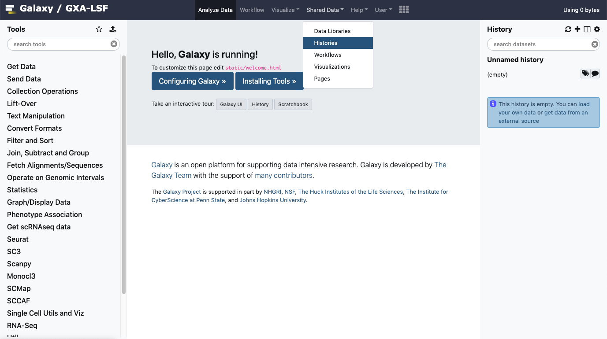
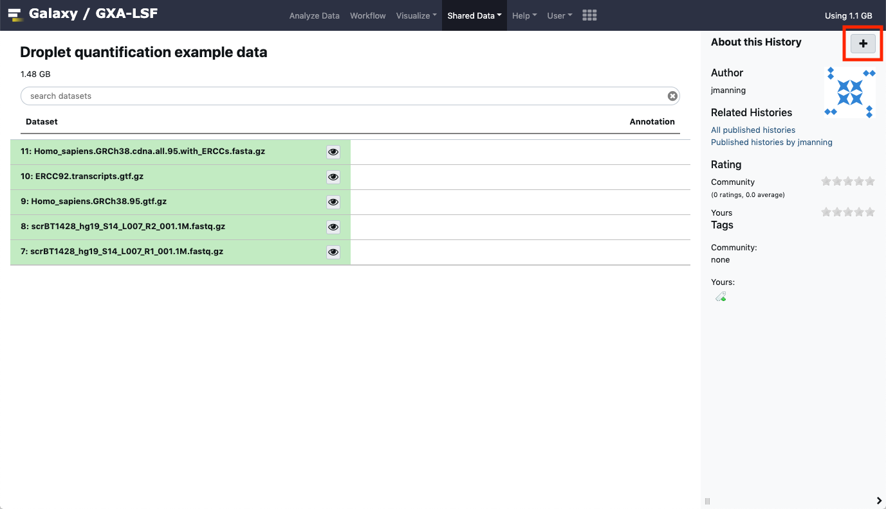

# Generating an expression matrix for single-cell RNA-seq data

This session will show you the principles of the initial phase of single-cell RNA-seq analysis: generating expression measures in a matrix. We'll be using a setup based on Galaxy to illustrate the process for teaching purposes. The process is relatively simple given currently available tools, but there are some complexities we'll explain. 

## 1. Example data

We've provided you with some example data to play with, stored in what Galaxy calls a 'history'. Access the shared history for this study:

 

If you click through to the history, you'll see that we've provided you with two 1 million-read FASTQ files and GTF files related to the gene annotations and to a set of spike-ins. You can then import the history to use yourself:

